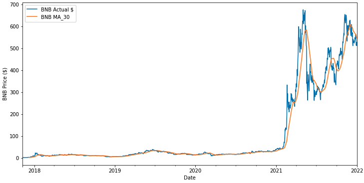
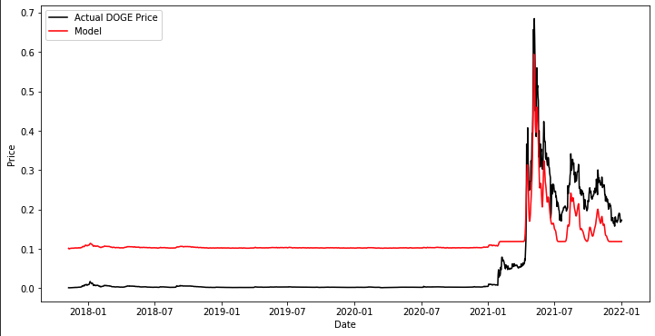
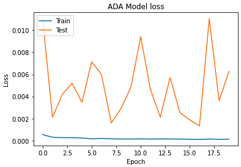

#  Project 2: Predicting Cryptocurrency Prices
By: Alex, James, Saydee
## 1. Introduction


- ### Purpose:

    * As cryptocurrencies gain in popularity, there has been a new push in order to see if traditional methods of analyzing stocks can be applied to the cryptocurrency markets as well. 
    * Specifically, the goal if this project was to create several models in order to predict and compare cryptocurrency prices. 
    * We hypothesized that although we were using several different cryptocurrencies, that the predictive ability of our models would provide similar results. 
    * This is because, unlike the random price action of the stock market, cryptocurrency prices often move in tandem with each other.
    * It seems that often the Bitcoin (BTC) price is an indicator for the performance of other cryptocurrencies as well.  

---

## 2. Data Preperation  

 - ### A. Where?

    * For this project we used the Yahoo Finance API 'yfinance' in order to pull historical prices on our desired cryptos. 
    * We chose this because of the ease-of-use, there is no need for API keys as compared to alternatives such as Quandl and Alpaca. 

 - ### B. How?

    * yfinance provides simple syntax for it's operations in order to do a wide variety of things from pulling stock data, to company financials and even analyst recommendations and identifying major shareholders. These functionalities make yfinance an API which I recommend to anybody doing stock market analysis.  
    * Here is a link to the yfinance documentation: 
    [yfinance](https://pypi.org/project/yfinance/)
---
 Example Code: 
```
{
  import yfinance as yf
  data = pd.download('Ticker', start='xxxx-xx-xx', end='xxxx-xx-xx')
  df = pd.DataFrame(data)
  df.head()
}
```

---
 - ### C. What?

    * We pulled data from Bitcoin (BTC), Ethereum (ETH), Doge Coin (DOGE), Cardano (ADA) and Binance Coin (BNB)
    * In our opinion, choosing cryptos in the top 10 list (by marketcap) was important because the prices of these cryptos are more correlated to the price of BTC than the smaller cap altcoins. 

 - ### D. Data Used: 

    * Pulling asset (stocks and crypto) prices from yfinance provides data for: Adjusted Close, Close, Open, High, Low and Volume. For this project all we needed was the 'Close' price in order to do our analysis and run our models. 
    * Close and 30 Day Moving Average were plotted in order to visualize our data and give us an idea of the crypto currency trends over our specific time period. 




---

## 3. SVR (Support Vector Regression) 

- ### A. What?

    * SVR (Support Vector Regression) is a tool combining Support Vector Machines (SVM) with regular Regression. SVR can provide a method of enhancing a regular regression line in order to account for minor fluctuations which is important when analyzing prices because a singular linear model will misrepresent our data. A hyperplane is used as the line of best fit but a margin is implemented in order to catch these 'outliers'. 

- ### B. Why Used:

    * Cryptocurrency prices are volatile, and this requires a margin in order to accurately represent these price movements. We used this model in order to fit our dates and prices and visualize our results.  

- ### C. Graphs: 





---

## 4. LSTM (Long Short Term Memory)

- ### A. What?

    * LSTM models are under the umbrella of Recurrent Neural Networks (RNN) which, for our model, takes the data sequentially using the previous data point (input) in order to influence the following data point (output). Ideally this process keeps only the 'important' data points in order to create a more accurate model.  

- ### B. Why Used?

    * We used the LSTM model because it is a good tool to filter through our data and has long been used in stock price predictions. We believed that if it can be used for stock market data successfully then there should be no reason for it to not work for cryptocurrency prices. 

- ### C. Graphs: Predicted Price and Model Loss





---

## 5. Conclusion / Findings

- ### A. Findings:

    * We ran into overfitting problems which caused our training data to be accurate while likely performing inadequetly for future price predictions. 
    * It is interesting that our models had such different loss levels from crypto to crypto. Training was consistently very low while the test loss changed in trend based on the crypto tested.  

- ### B. What We Would Change?

    * When it comes to the SVR model used on BTC it was difficult to compare against other cryptos because there was a scaling issue which requires some troubleshooting. 
    * We used data from 2017-2022 which is a large timeframe to use when analyzing crypto prices. The major problem is that cryptocurrency prices remained relately stable throughout much of the past 5 years until around 2020. This means that our model was often training in different price action conditions than what more recently has been the case. 
    * This may be the reason behind our predictive model not catching the magnitude of price action from 2020 onward. 


